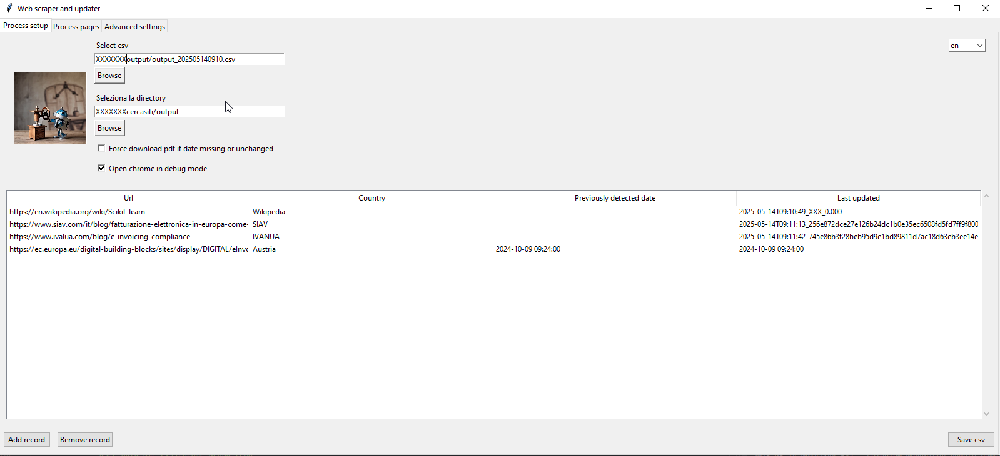
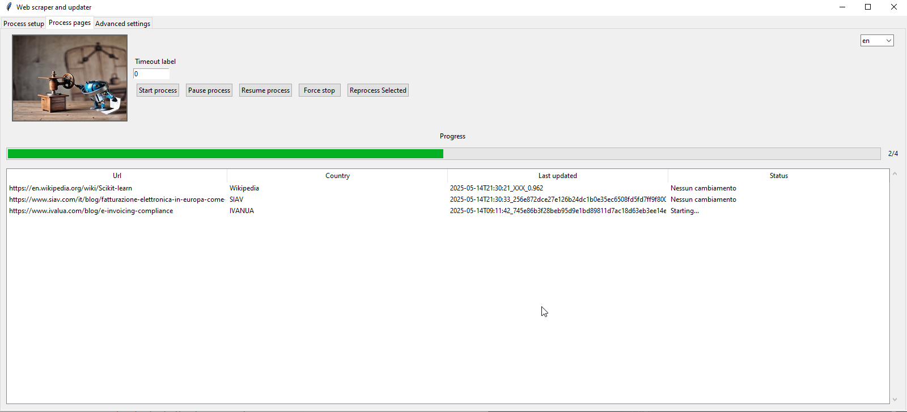
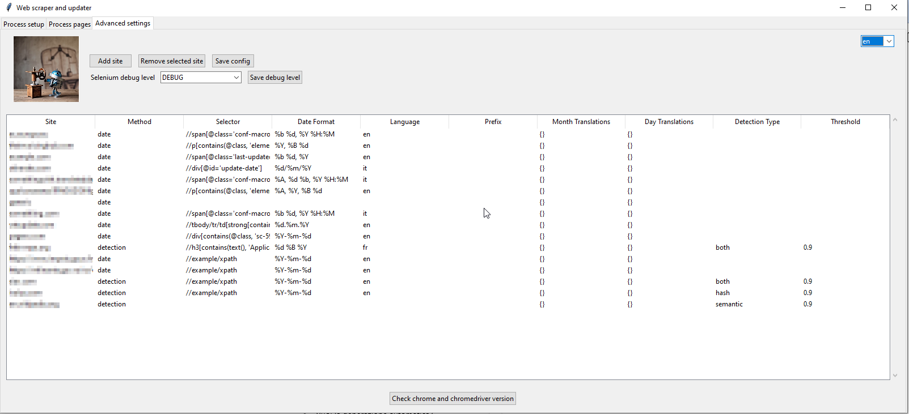

# 🌐 Web Update Monitor & Localization Editor

An advanced Python-based tool for **monitoring website updates**, exporting pages to **PDF**, and detecting changes using **one of three strategies**:  
- **Explicit date extraction via XPath**
- **Hash comparison**
- **Semantic text similarity**

Includes a GUI-based JSON editor to manage the multilingual interface via `locales.json`.

---

## 🔧 Features

### 🕸 Web Update Monitor
- Reads list of URLs from a CSV file
- Detects updates using:
  - 📅 **Date extraction** from specific HTML elements (XPath + formatting rules)
  - 🔁 **Hash comparison** to detect structural changes
  - 🧠 **Semantic similarity** to detect content changes
- Automatically downloads a PDF snapshot when changes are detected
- Saves structured CSV logs (output and errors)
- Chrome Debug mode supported
- Multilingual interface powered by `locales.json`
- Embedded GUI video (visual only)

### 🌍 JSON Localization Editor
- GUI for editing `locales.json`
- Highlights missing translations per language
- Auto-fill from English (`en`)
- Add/remove/edit translation keys across multiple languages
- Maintains JSON structure and allows custom key sorting

---

## 🖼️ Screenshots

### 🧩 Tab 1 – Process Setup
This tab allows you to load your CSV input, set output directories, and enable debug mode.



---

### 📄 Tab 2 – Process Pages (with progress and detection)
Start the detection process, monitor progress, and observe updates based on date, hash, or semantic analysis.



---

### ⚙️ Tab 3 – Advanced Settings
Configure site-specific detection methods, XPath selectors, formats, and thresholds.



---

## 📦 Requirements

- Python 3.9+
- Google Chrome installed
- Matching `chromedriver.exe`
- Python dependencies:
  - `selenium`, `psutil`, `imageio`, `Pillow`, `tkinterdnd2`, `bs4`, `python-dateutil`

Install all dependencies:

```bash
pip install -r requirements.txt
```

---

## ▶️ How to Use

### Start the Web Scraper

```bash
python webscraper_NEW.py
```

### Launch the Localization Editor

```bash
python traduzioneJson.py
```

---

## 🗂️ Project Structure

```
📁 output/                # PDF and CSV output
📁 log/                   # Log files
📁 semantics/             # semantic txt file for version comparaison
📄 config.json            # Scraper configuration
📄 locales.json           # UI translations
📄 webscraper_NEW.py      # Main scraping application
📄 traduzioneJson.py      # JSON localization editor
📄 webscraperRobot.mp4    # Just a funny video running in Tab 2 while working.
📄 webscraper_icon.ico    # icon for compiling
📄 webscraper_icon.ico    # Original icon png
📄 webscraper_leggero.bat # Batch to create an exe file. you need appropriate include
📄 requirements.txt       # requirements to make the script work into a python environment
```

---

## ✍️ Description

> **Web update monitor with PDF export, date parsing, hash and semantic change detection**

---

## 🔒 License

MIT License – see the `LICENSE` file for full details.

---

## 👤 Author

**Paolo Forte**  


Install all dependencies:

```bash
pip install -r requirements.txt

